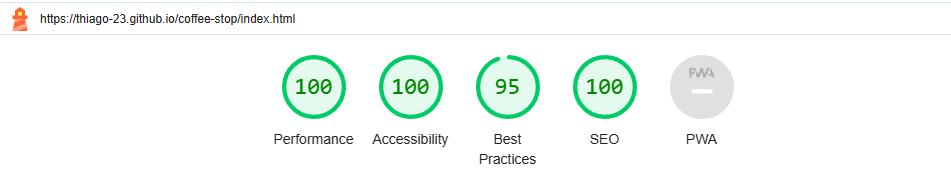

# Café Stop

Cafe stop is a website designed to cultivate a sense of community and connection through the joy of shared meals.  It's a morning ritual, a place where locals and visitors come together to savor the perfect start to their day.

Invites you to embark on a culinary adventure, discovering the art of breakfast and the essence of exceptional coffee.

## Demo

Link to the live site here: <https://thiago-23.github.io/coffee-stop/>

---

# Table of contents

* [User Experience (UX)](#user-experience-ux)
  * [User Stories](#user-stories)
  
* [Technologies Used](#technologies-used)
  * [Languages Used](#languages-used)
  
* [Design](#design)

* [Features](#features)
  * [Existing Features](#existing-features)

* [Testing](#testing)

* [Deployment and Local Developent](#deployment-and-local-developent)
  * [Deployment](#deployment)

  * [LocalDevelopment](#local-development)
    * [How to Fork](#how-to-fork)
    * [How to Clone](#how-to-clone)
  
---

## User Experience (UX)

#### The Ideal User Key information

* Where to find the locations and directions with maps for easy access.
* A structure for easy navigation, ensuring users can quickly find what they're looking for.
* A visually appealing overview of the breakfast menu and coffee selection.
* What is Cafe Stop and what does it offer?.
* A cosy ambiance, decor, and overall vibe for all audiences.

### User Stories

#### User Goals

* As a user, I want to ensure that the website loads quickly and is responsive, guaranteeing a seamless experience regardless of the device.
* As a user, I want to assure that the security of any personal information provided is protected.
* As a user, I want to know exactly where the Cafe Stop is located.
* As a user, I want to ensure that essential information such as contact details and social media links are readily accessible.
* As a user, I want to quickly access the latest breakfast offerings and any new additions to the coffee menu.

#### First-Time Visitor Goals

* As a first-time visitor, I want to View high-quality images of the Cafe Stop ambiance and signature dishes.
* As a first-time visitor, I want to Check reviews or testimonials from other first-time visitors for social proof.
* As a first-time visitor, I want to be able to find information about Cafe Stop and contact details.
* As a first-time visitor, I want to Explore the breakfast menu to get an idea of the variety available.
* As a first-time visitor, I want to understand the coffee shop's vibe, offerings, and location.

#### Returning Visitor Goals

* As a returning visitor, I want to access the latest breakfast menu to discover any new additions or seasonal specials.
* As a returning visitor, I want to Check for any events or promotions happening at Cafe Stop during my next planned visit.
* As a returning visitor, I want to Provide feedback on my previous experiences and see how it has been incorporated.

#### Frequent Visitor Goals

* As a frequent visitor, I want to Receive exclusive offers or early access to limited-time menu items as a loyal customer.
* As a frequent visitor, I want to Cafe Stop maintain transparent communication about any updates and changes

---

## Technologies Used

### Languages Used

* HTML
* CSS

---

## Design

---

## Features

### Existing Features

The website features a user-friendly interface with four pages(home page, menu page, gallery page and conatct page).

* All pages has a logo(top left), a navigation bar, footer and a back to top button located at (button right with a yellow color).

* Navigation bar that is responsive to all screen sizes.
  

#### Footer

* A footer with accessible links to social media.

#### Home Page

* About Us Section

* Testimonials

* Menu Page

* Gallery Page

* Contact Form

* Contact Location

---

## Testing

### W3C Validator

W3C Markup Validator were used to valitade each page of the project to ensure there no syntax errors.

[W3C Validator](https://validator.w3.org/)

* Index Page

* Menu Page

* Gallery Page

* Contact Page

### W3C CSS Validator

CSS - No syntax errors were found using Jigsaw css validator.

[Jigsaw Validator](https://jigsaw.w3.org/css-validator/)

* CSS Page

---

### Lighthouse

Lighthouse within the Chrome Developer Tools are used to test the performance, accessibility, best practices and SEO of the  Cafe Stop website.

* Index Page

* Menu Page

* Gallery Page

* Contact Page

---

## Deployment and Local Developent

### Deployment

Github Pages were used to deploy the live website. The instructions to achieve this are below:

1. Log in (or sign up) to Github.
2. Find the repository for this project, P01-Allotment-garden.
3. Click on the Settings link.
4. Click on the Pages link in the left-hand side navigation bar.
5. In the Source section, choose main from the drop-down select branch menu. Select Root from the drop-down select folder menu.
6. Click Save. Your live Github Pages site is now deployed at the URL shown.

### Local Development

#### How to Fork

To fork the P01-Allotment-gardens repository:

1. Log in (or sign up) to Github.
2. Go to the repository for this project, Zest-studi-o/P01-Allotment-gardens.
3. Click the Fork button in the top right corner.

#### How to Clone

To clone the P01-Allotment-gardens repository:

1. Log in (or sign up) to GitHub.
2. Go to the repository for this project, Zest-studi-o/P01-Allotment-gardens.
3. Click on the code button, select whether you would like to clone with HTTPS, SSH or GitHub CLI and copy the link shown.
4. Open the terminal in your code editor and change the current working directory to the location you want to use for the cloned directory.
5. Type 'git clone' into the terminal and then paste the link you copied in step 3. Press enter.

---

## Credits

## Media

* [IStock](https://www.istockphoto.com/)
* [Font awesome](https://fontawesome.com/icons)
* [Iconmonstr](https://iconmonstr.com/?s=coffee)
* [Coolors](https://coolors.co/)
* [You Tube Flexbox Tutorial](https://www.youtube.com/playlist?list=PL4cUxeGkcC9i3FXJSUfmsNOx8E7u6UuhG)
* [Google Fonts](https://fonts.google.com/)
* [Mockup Screenshot Generator](https://ui.dev/amiresponsive)

## Reference Material

* [Love Running Walkthrough project](https://github.com/Code-Institute-Solutions/love-running-v3/tree/main/8.1-testing-and-validation)
* [Love Running Walkthrough project readme template](https://github.com/Code-Institute-Solutions/readme-template)
* [Flexbox](https://css-tricks.com/snippets/css/a-guide-to-flexbox/)
* [W3 School](https://www.w3schools.com/)
* [Stackoverflow - Back to top button](https://stackoverflow.com/search?q=back+to+top+button)

---

## Acknowledgements

* [Derek McAuley](https://github.com/derekmcauley7), My code institute Mentor who support and clarify all my queries.
* Tutor Assistance at Code institute when I had an issue with codeanywhere.
